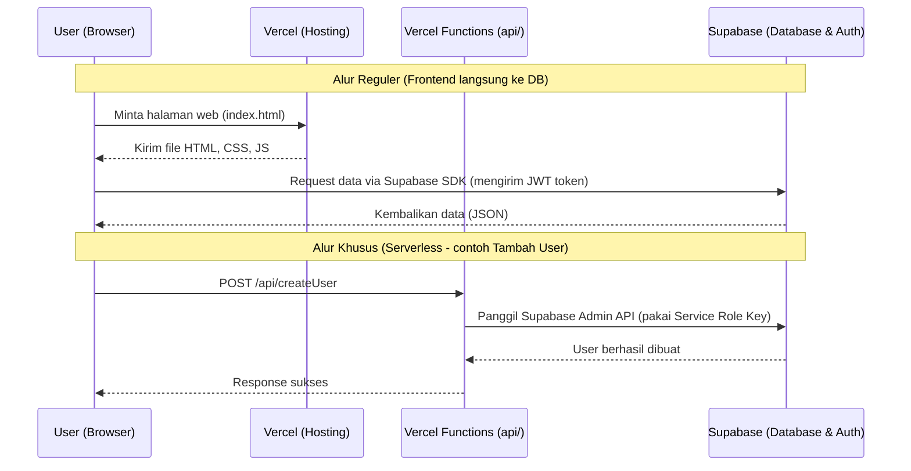

# Gambaran Besar Arsitektur Maintory

Dokumen ini menjelaskan arsitektur dasar dari aplikasi Maintory. Maintory adalah aplikasi **Single Page Application (SPA)** yang sekaligus berfungsi sebagai **Progressive Web App (PWA)**, dibangun dengan React dan dikelola datanya menggunakan **Supabase**.

## 1. Alur Sistem (Architecture Flow)

Aplikasi ini menggunakan pola *Backend-as-a-Service* (BaaS), di mana aplikasi React di browser langsung berkomunikasi dengan Supabase (PostgreSQL) menggunakan SDK resmi dari Supabase. Hanya ada sedikit *Serverless Functions* di Vercel untuk aksi khusus (seperti membuat user).

## 2. Struktur Folder Project

Berikut adalah struktur folder Maintory dan kegunaan masing-masing:

- `api/`: Berisi kode yang berjalan di server Vercel (bukan di browser). Disebut *Serverless Functions*. Digunakan untuk tugas yang butuh hak akses tinggi (Admin), misalnya `createUser.js` dan `deleteUser.js`.
- `src/`: Tempat utama semua kode frontend (React) berada.
  - `App.jsx`: File pusat yang mengatur **Routing** (perpindahan halaman). Di sinilah URL dihubungkan dengan komponen halaman.
  - `main.jsx`: Titik masuk (entry point) React ke dalam file HTML.
  - `index.css`: File CSS global.
  - `assets/`: Tempat menaruh gambar statis dan logo.
  - `components/`: Kumpulan komponen React yang bisa dipakai berulang-ulang (reusable), seperti tombol, modal, atau sidebar.
  - `contexts/`: Tempat menyimpan *Global State*. Di sini ada `AuthContext.jsx` yang menyimpan data login user agar bisa diakses dari halaman mana saja tanpa harus dioper satu per satu.
  - `lib/`: Tempat konfigurasi *third-party libraries*.
    - `supabase.js`: Untuk koneksi standar dari browser ke Supabase.
    - `supabaseAdmin.js`: Untuk koneksi dengan hak admin (Service Role), hanya aman dipanggil dari sisi server.
  - `pages/`: Berisi folder-folder untuk setiap halaman di aplikasi (contoh: dashboard, inventory, jaringan).
  - `utils/`: Kumpulan fungsi bantuan (helpers) seperti logika export ke Excel, pencatatan log aktivitas, dan pengecekan akses (RBAC).
- `public/`: File statis seperti favicon dan file konfigurasi PWA.
- `dist/`: Folder hasil *build*. Ini adalah folder yang sebenarnya diunggah ke Vercel untuk di-hosting.
- `vercel.json`: Konfigurasi khusus untuk server Vercel.
- `vite.config.js`: Pengaturan Vite (alat pembuat/builder project), termasuk konfigurasi PWA agar aplikasi bisa diinstall di HP/PC.
- `package.json`: Daftar semua "perpustakaan" (dependencies) atau kode orang lain yang kita pakai di project ini.

## 3. Tech Stack Lengkap

| Teknologi | Fungsi | Alasan Mengapa Dipakai |
|-----------|--------|------------------------|
| **React** | UI Framework | Standar industri untuk membangun Single Page Application. Memudahkan pembuatan antarmuka (UI) yang interaktif dengan konsep komponen. |
| **Vite** | Build Tool | Sangat cepat (fast refresh) dibandingkan Create React App (CRA) lama, membuat proses development jauh lebih ngebut. |
| **Supabase** | Backend & Database | Memberikan database PostgreSQL siap pakai lengkap dengan sistem Autentikasi dan API otomatis, sehingga kita tidak perlu coding backend dari nol. |
| **Vercel** | Hosting | Hosting gratis yang sangat mudah diintegrasikan dengan GitHub. Setiap kali ada kode yang di-*push* ke GitHub, Vercel otomatis melakukan *build* dan *deploy*. |
| **React Router** | Routing | Mengatur perpindahan antar halaman di dalam SPA tanpa perlu *reload* seluruh halaman browser. |
| **Zustand / Context** | State Management | Di project ini kita menggunakan Context API bawaan React untuk manajemen *state* ringan seperti sesi login. |
| **ExcelJS & XLSX** | Manipulasi Excel | Karena aplikasi ini sering mengekspor laporan ke Excel (sesuai format kantor pusat), library ini sangat vital untuk membaca dan menulis file `.xlsx`. |

## 4. Alur Request Step by Step (Contoh: Tambah Maintenance)

Mari kita bedah apa yang terjadi di belakang layar saat seorang Teknisi menambahkan tiket Maintenance baru:

1. **User Interaksi**: Teknisi mengisi form di halaman `/maintenance` dan menekan tombol "Simpan".
2. **React State**: Komponen React mengambil data dari input (disimpan di *state* lokal) dan menyiapkan objek JSON.
3. **Supabase SDK Call**: Kode React memanggil fungsi Supabase: 
   `supabase.from('maintenance_tickets').insert({ title: 'Kabel Putus', ... })`
4. **Network Request**: Supabase SDK secara otomatis membuat HTTP POST request ke server Supabase. Request ini menyertakan JWT Token (bukti login) di dalam header.
5. **Validasi RLS di Supabase**: Database Supabase menerima request tersebut. Sebelum menyimpan, Supabase mengecek *Row Level Security (RLS)*: "Apakah user dengan token ini boleh menambahkan tiket?"
6. **Data Disimpan**: Jika diizinkan, Supabase menyimpan data ke PostgreSQL dan membalas dengan status 201 (Created) ke browser.
7. **UI Update**: React menerima balasan sukses, menghapus isi form, memunculkan notifikasi toast ("Berhasil!"), dan memperbarui daftar tabel di layar tanpa me-*reload* halaman.

## 5. Konsep Penting: Apa itu SPA?

**Single Page Application (SPA)** berarti aplikasi web ini secara harfiah hanya memiliki **satu** file HTML (`index.html`). 

Lalu bagaimana bisa ada banyak halaman (`/dashboard`, `/maintenance`, dll)?
Rahasia-nya ada di JavaScript (React Router). Saat user mengklik link, browser *tidak* meminta file HTML baru ke server Vercel. Alih-alih, JavaScript akan menghapus komponen lama dari layar dan "menggambar" (merender) komponen baru secara instan. Ini membuat aplikasi terasa sangat cepat dan mulus seperti aplikasi *native* di HP.

*Bukti di `vercel.json`*: Konfigurasi `{ "rewrites": [{ "source": "/(.*)", "destination": "/index.html" }] }` memaksa Vercel untuk selalu mengembalikan `index.html` apa pun URL yang diketik user, lalu membiarkan React yang menentukan tampilan halamannya.

## 6. Konsep Penting: Apa itu PWA?

**Progressive Web App (PWA)** adalah teknologi yang mengubah web biasa menjadi "rasa aplikasi asli".
- **Bisa di-install**: Muncul tombol "Add to Home Screen" di HP Android/iOS, atau "Install" di Chrome PC.
- **Service Worker**: Script kecil yang berjalan di latar belakang. Script ini menyimpan (nge-cache) file-file penting sehingga aplikasi bisa terbuka lebih cepat atau bahkan saat offline (meski data dari database tetap butuh internet).
- Di project ini, PWA diatur oleh `vite-plugin-pwa` di dalam file `vite.config.js`.
