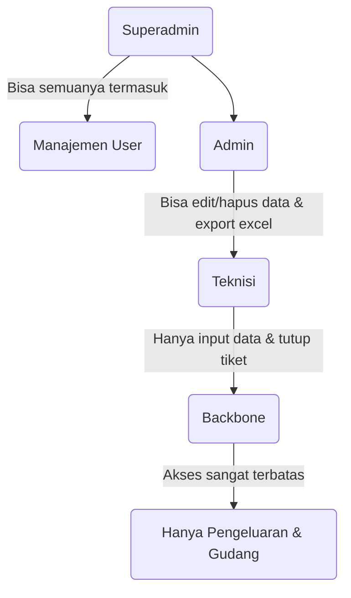

# Panduan Fitur Maintory

Dokumen ini memetakan seluruh fitur dan halaman yang ada di Maintory, alur kerjanya, serta beberapa bagian yang masih perlu ditingkatkan.

## 1. Peta Fitur Keseluruhan

| Rute Halaman | Nama Fitur | Fungsi Utama | File Komponen Utama |
|--------------|------------|--------------|---------------------|
| `/` | **Dashboard** | Menampilkan statistik harian (grafik, tiket masuk) & alert tiket *overdue*. | `pages/dashboard/Dashboard.jsx` |
| `/maintenance` | **Maintenance** | Mengelola tiket IKR/PSB, instalasi ODC/ODP, dan gangguan. | `pages/maintenance/Maintenance.jsx` |
| `/inventory/stok` | **Stok Gudang** | Inventarisasi material/barang (kabel, konektor, modem, dll). | `pages/inventory/StokGudang.jsx` |
| `/inventory/sn` | **Serial Number** | Pendataan Serial Number (SN) perangkat ONT dan Router. | `pages/inventory/SerialNumber.jsx` |
| `/inventory/dropcore` | **Dropcore** | Manajemen rol/gulungan kabel Dropcore dan mutasi pemakaiannya. | `pages/inventory/Dropcore.jsx` |
| `/inventory/adss` | **Kabel ADSS** | Manajemen stok gulungan kabel ADSS beserta log riwayat potongan. | `pages/inventory/Adss.jsx` |
| `/bon-barang` | **Bon Barang** | Fitur untuk *request* pemakaian material dari gudang ke lapangan. | `pages/dispatch/BonBarang.jsx` |
| `/pengeluaran` | **Pengeluaran** | Menjadwalkan & mencatat realisasi pengeluaran fisik barang gudang. | `pages/pengeluaran/Pengeluaran.jsx` |
| `/dismantle` | **Dismantle** | Data penarikan (dismantle) perangkat dari pelanggan yang berhenti langganan. | `pages/dismantle/Dismantle.jsx` |
| `/ont` | **ONT Replacement** | Catatan pergantian perangkat ONT pelanggan yang rusak/upgrade. | `pages/ont/OntReplacement.jsx` |
| `/laporan-pemasangan`| **Laporan Pemasangan**| Mencetak laporan harian/bulanan hasil pekerjaan teknisi. | `pages/laporan/LaporanPemasangan.jsx`|
| `/banner-maintenance`| **Banner Maintenance** | Mem-generate gambar/poster info maintenance untuk di-share ke grup pelanggan.| `pages/banner/BannerMaintenance.jsx`|
| `/jaringan/tiang` | **Data Tiang** | Pemetaan koordinat dan data tiang fiber optik perusahaan. | `pages/jaringan/DataTiang.jsx` |
| `/jaringan/odp-odc` | **Data ODP & ODC** | Pemetaan *Optical Distribution Point* (ODP) dan *Cabinet* (ODC). | `pages/jaringan/DataOdpOdc.jsx` |
| `/jaringan/konversi` | **Konversi Jaringan** | Fitur export data tiang dan ODP/ODC ke dalam format Excel standar pusat. | `pages/jaringan/KonversiTiang.jsx` |
| `/logs` | **Log Aktivitas** | Jejak audit (audit trail) siapa melakukan apa kapan. | `pages/activity/ActivityLogs.jsx` |
| `/settings` | **Pengaturan** | Ubah avatar, ganti password, manajemen user (untuk superadmin). | `pages/settings/Settings.jsx` |

## 2. Detail & Alur Data (Contoh: Fitur Tiket Maintenance)

Saat user menambahkan tiket baru di halaman `/maintenance`:

1. **UI (User Interface):** User mengklik tombol "Tambah Tiket". Sebuah modal *popup* muncul dengan form input (nama pelanggan, alamat, keluhan). Data yang diketik ditangkap oleh React *state* (contoh: `const [formData, setFormData] = useState({...})`).
2. **Logic:** Saat di-submit, aplikasi tidak memanggil backend custom buatan sendiri, melainkan langsung memanggil Supabase SDK:
   ```javascript
   const { data, error } = await supabase.from('maintenance_tickets').insert([ formData ]);
   ```
3. **Database (Supabase):** Supabase menerima JSON tersebut, memvalidasi JWT token pengirim, lalu menyisipkannya (INSERT) ke tabel PostgreSQL `maintenance_tickets`.
4. **Log & UI Update:** Jika INSERT berhasil, fungsi `logActivity()` dipanggil untuk mencatat "User X membuat tiket Y", dan daftar tiket di layar langsung dimuat ulang (`fetchTickets()`) agar data terbaru muncul seketika tanpa perlu menekan F5/Refresh browser.

## 3. Sistem Role & Permission

Sistem hak akses diatur dalam 4 tingkatan Role. Pengecekan ada di frontend (`utils/permissions.js`).



Di kodingan React, sebuah tombol (misal tombol Hapus) baru akan dirender (ditampilkan) jika fungsi `can()` mengembalikan nilai *true*:
```jsx
{can(profile.role, 'maintenance.delete') && (
   <button className="btn-delete">Hapus</button>
)}
```

## 4. Fitur Excel (Laporan Canggih)

Maintory sangat bergantung pada file Excel untuk pelaporan. Aplikasi ini tidak hanya mengekspor CSV sederhana, tetapi **membuat laporan dengan desain, warna sel, dan border** menggunakan library `exceljs` dan `xlsx`.

- **Alur Export:** React mengambil data mentah dari Supabase (JSON array) -> di-*looping* menggunakan `exceljs` untuk digambar per sel (baris demi baris, ditambah warna *header*) -> dikonversi menjadi *blob* file -> diunduh otomatis ke komputer user (`utils/excelHelper.js`).

## 5. ⚠️ Fitur yang Masih Perlu Diperkuat

Karena Maintory dibangun dengan cepat (sebagai MVP/Prototype awal), ada beberapa hal yang masih rentan dan perlu diperkuat kedepannya:

- ⚠️ **Kurangnya Input Validation (Validasi Form):** 
  Sebagian besar form tidak punya pengecekan ketat (misal, nomor telepon diisi huruf mungkin masih tembus). Sebaiknya menggunakan library seperti `Zod` di masa depan.
- ⚠️ **Tidak ada "Undo" atau Konfirmasi Hapus Massal:** 
  Pada beberapa bagian (terutama fitur pengeluaran/inventory), klik tombol Hapus langsung mengeksekusi penghapusan di database tanpa peringatan "Apakah Anda yakin?". Ini berisiko salah klik (fat finger error).
- ⚠️ **Pagination Manual & Limit Data:** 
  Beberapa *query* pengambilan data dari Supabase masih me-*load* (memuat) seluruh data sekaligus tanpa *limit/pagination* (paging). Jika data sudah mencapai puluhan ribu baris, aplikasi web akan terasa nge-hang/sangat lambat saat dibuka. Harus segera menggunakan fungsi `.range(0, 99)` dari Supabase.
